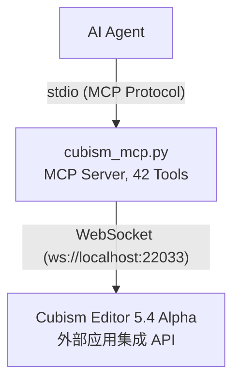

# Cubism External Edit MCP

[](https://www.live2d.com/cubism/download/editor/)
[](https://www.python.org/)
[](https://modelcontextprotocol.io/)
[](https://pypi.org/project/cubism-mcp/)

[](LICENSE)
[](https://github.com/nana7chi/CubismExternalEditMCP/stargazers)
[](https://github.com/nana7chi/CubismExternalEditMCP/commits)

[中文](README.md) | [English](i18n/README_EN.md) | [日本語](i18n/README_JA.md) | [한국어](i18n/README_KO.md)

将 Live2D Cubism Editor 的外部应用集成 API 封装为 **MCP (Model Context Protocol)** 工具，让 AI Agent 通过自然语言操控 Cubism Editor 进行建模操作。

> 官方下载及参考文档：https://creatorsforum.live2d.com/t/topic/3938

## 架构



## 功能特性

- **读写操作** — 读取/写入模型参数值、查看文档列表、获取编辑模式（适用 Editor 4.x+）
- **完整模型查询** — 参数结构、部件结构、变形器结构、单个对象详情（需 5.4 Alpha）
- **编辑操作** — 增删改查参数/部件/变形器/ArtMesh/Glue，自动事务包裹（需 5.4 Alpha）
- **批量编辑** — 同一事务内执行多个操作，任一失败自动回滚
- **权限分级** — 读写需 Allow 授权，编辑需 Edit 授权
- **自动重连** — Editor 重启后自动重连，3 秒间隔
- **Token 持久化** — 认证令牌缓存到 `~/.cubism-mcp/token.txt`，避免重复授权

## 环境要求

| 组件 | 版本 |
|------|------|
| Python | ≥ 3.10 |
| Cubism Editor | 5.4 Alpha（有效期至 2026-09-14） |
| 操作系统 | Windows / macOS |

## 使用流程

### 快速开始

**复制以下提示词发给你的 AI Agent**：

> 根据 https://github.com/nana7chi/CubismExternalEditMCP/blob/master/README.md 完成 cubism-mcp 的安装和配置。如果电脑上还没有 `uv`，请先帮我安装。配置完成后告诉我是否就绪。


### 第一步：安装 uv（仅一次）

`uv` 是一个极小的 Python 包管理器，用于自动安装和运行本 MCP。安装后无需再管 Python 环境。

**macOS**（终端粘贴运行）：
```bash
curl -LsSf https://astral.sh/uv/install.sh | sh
```

**Windows**（PowerShell 粘贴运行）：
```powershell
powershell -ExecutionPolicy ByPass -c "irm https://astral.sh/uv/install.ps1 | iex"
```

安装完成后**重启终端**，输入 `uv --version` 能看到版本号即成功。

### 第二步：在 AI Agent 中配置 MCP

> 支持 `ClaudeCode`, `Codex`, `Workbuddy` 等各种支持MCP的客户端

> 第一次启动会自动下载依赖包，耗时约 1–2 分钟，之后秒启。

#### 方式一：PyPI 安装（推荐）

```json
{
  "mcpServers": {
    "cubism-mcp": {
      "type": "stdio",
      "command": "uvx",
      "args": ["cubism-mcp"],
      "description": "Cubism Editor MCP",
      "env": { "NO_PROXY": "localhost,127.0.0.1" }
    }
  }
}
```

#### 国内镜像源配置

如果 PyPI 官方源下载慢，可使用国内镜像（清华/阿里云/腾讯云等均可用）：

```json
{
  "mcpServers": {
    "cubism-mcp": {
      "type": "stdio",
      "command": "uvx",
      "args": ["--index-url", "https://pypi.tuna.tsinghua.edu.cn/simple", "cubism-mcp"],
      "description": "Cubism Editor MCP",
      "env": { "NO_PROXY": "localhost,127.0.0.1" }
    }
  }
}
```

> 也可替换为阿里云 `https://mirrors.aliyun.com/pypi/simple` 或腾讯云 `https://mirrors.cloud.tencent.com/pypi/simple`。

#### 方式二：uvx 在线运行（GitHub 源）

```json
{
  "mcpServers": {
    "cubism-mcp": {
      "type": "stdio",
      "command": "uvx",
      "args": ["--from", "git+https://github.com/nana7chi/CubismExternalEditMCP.git", "cubism-mcp"],
      "description": "Cubism Editor MCP",
      "env": { "NO_PROXY": "localhost,127.0.0.1" }
    }
  }
}
```

#### 方式三：本地克隆运行

1. 克隆源码到本地(或下载ZIP并解压)

```bash
git clone https://github.com/nana7chi/CubismExternalEditMCP.git
```

2. 添加以下MCP配置（修改 `cwd` 为实际路径）：

```json
{
  "mcpServers": {
    "cubism-mcp": {
      "type": "stdio",
      "command": "python",
      "args": ["cubism_mcp.py"],
      "cwd": "J:/修改为实际路径/CubismExternalEditMCP",
      "description": "Cubism Editor MCP",
      "env": { "NO_PROXY": "localhost,127.0.0.1" }
    }
  }
}
```

### 第三步：在 Cubism Editor 中开启外部集成

1. 启动 Cubism Editor 5.4 Alpha，打开一个模型
2. 菜单「**文件**」→「**外部应用程序集成的设置**」
3. 确认端口为 `22033`，打开「**使用**」开关
4. 弹出授权对话框，找到 `cubism-mcp`，**勾选 Allow 和 Edit**，点 OK
> 如果没看到弹窗，检查 Editor 右下角是否有闪烁的外部应用图标，点击即可打开对话框。


### 第四步：开始使用

在 AI Agent 中用自然语言操控 Editor，例如：

```
"列出当前模型的参数结构"
"查看部件层级"
"把眉毛部件的标签色改成蓝色"
"新建参数 ParamsTest，ID 为 ParamTest，范围 0-1，默认 0.5"
"批量添加 3 个关键帧到 ParamAngleX"
```

> **注意**：每次重启 Cubism Editor 后，都需要重新开启「外部应用集成」开关并勾选 Allow + Edit 权限。

## 可用工具

### 诊断

| 工具 | 说明 |
|------|------|
| `cubism_status` | 检查连接状态、注册状态、Allow/Edit 授权 |

### 读写操作

| 工具 | 参数 | 说明 |
|------|------|------|
| `cubism_get_model_uid` | — | 获取当前打开模型的 UID |
| `cubism_get_documents` | — | 列出所有打开的文档（建模/物理/动画） |
| `cubism_get_document` | `document_uid` | 按 UID 获取单个文档详情 |
| `cubism_get_current_edit_mode` | — | 获取编辑模式（Physics/Modeling/Animation/…） |
| `cubism_get_parameter_values` | `model_uid`, `ids?` | 读取模型参数当前值 |
| `cubism_set_parameter_values` | `model_uid`, `parameters[]` | 写入参数值（无需编辑事务） |
| `cubism_clear_parameter_values` | `model_uid` | 清除 SetParameterValues 的临时缓存 |
| `cubism_get_parameters` | `model_uid` | 参数元信息（名称/范围/Keyform/类型） |
| `cubism_get_parameter_groups` | `model_uid` | 参数组列表 |

### 查询结构（5.4 Alpha 新增）

| 工具 | 参数 | 说明 |
|------|------|------|
| `cubism_get_parameter_structure` | `model_uid` | 参数完整结构树（组+参数层级） |
| `cubism_get_part_structure` | `model_uid` | 部件结构树（ArtMesh/Deformer/Part/Glue） |
| `cubism_get_deformer_structure` | `model_uid` | 变形器结构树 |
| `cubism_get_object` | `model_uid`, `id` | 获取指定对象详情 |
| `cubism_get_selected` | `model_uid` | 获取当前选中的对象列表 |
| `cubism_get_parameter_keys` | `model_uid`, `object_id` | 获取对象的关键帧绑定关系 |
| `cubism_get_objects_by_parameter_keys` | `model_uid`, `parameter_id`, `key_value` | 按参数关键帧反查关联对象 |

### 编辑操作（5.4 Alpha 新增）

每个编辑 Action 均有独立 Tool（带完整类型签名和参数校验），同时保留 `cubism_edit` / `cubism_edit_batch` 用于批量操作。

#### 参数编辑

| Tool | Action | 说明 |
|------|--------|------|
| `cubism_add_parameter` | AddParameter | 添加参数 |
| `cubism_edit_parameter` | EditParameter | 编辑参数属性 |
| `cubism_delete_parameter` | DeleteParameter | 删除参数 |
| `cubism_add_parameter_group` | AddParameterGroup | 添加参数组 |
| `cubism_edit_parameter_group` | EditParameterGroup | 编辑参数组属性 |
| `cubism_delete_parameter_group` | DeleteParameterGroup | 删除参数组 |
| `cubism_move_parameter` | MoveParameter | 移动参数到指定组 |
| `cubism_move_parameter_group` | MoveParameterGroup | 调整参数组顺序 |

#### 关键帧编辑

| Tool | Action | 说明 |
|------|--------|------|
| `cubism_add_parameter_key` | AddParameterKey | 添加关键帧 |
| `cubism_delete_parameter_key` | DeleteParameterKey | 删除关键帧 |
| `cubism_move_parameter_key` | MoveParameterKey | 移动关键帧位置 |

#### 部件编辑

| Tool | Action | 说明 |
|------|--------|------|
| `cubism_add_part` | AddPart | 添加部件 |
| `cubism_edit_part` | EditPart | 编辑部件属性 |
| `cubism_edit_artmesh` | EditArtMesh | 编辑 ArtMesh 属性 |
| `cubism_edit_glue` | EditGlue | 编辑 Glue 属性 |
| `cubism_delete_object` | DeleteObject | 删除对象 |
| `cubism_move_object_on_parts_palette` | MoveObjectOnPartsPalette | 移动对象在部件面板的位置 |

#### 变形器编辑

| Tool | Action | 说明 |
|------|--------|------|
| `cubism_add_warp_deformer` | AddWarpDeformer | 添加弯曲变形器 |
| `cubism_add_rotation_deformer` | AddRotationDeformer | 添加旋转变形器 |
| `cubism_edit_warp_deformer` | EditWarpDeformer | 编辑弯曲变形器属性 |
| `cubism_edit_rotation_deformer` | EditRotationDeformer | 编辑旋转变形器属性 |

#### 选择操作

| Tool | 说明 |
|------|------|
| `cubism_add_selected_objects` | 编程式选中对象 |
| `cubism_clear_selected_objects` | 清除所有选中 |

#### 通用

| Tool | 参数 | 说明 |
|------|------|------|
| `cubism_edit` | `action`, `params` | 通用编辑入口（向后兼容） |
| `cubism_edit_batch` | `actions[]` | 批量编辑（单事务，失败回滚） |

## 常见问题

| 症状 | 原因 | 解决 |
|------|------|------|
| MCP 状态红色 | Python 路径/依赖/`cwd` 错误 | 检查 Python 版本 ≥ 3.10，确认依赖安装、`cwd` 路径正确 |
| 未连接到 Editor | Editor 未启动或外部集成未开启 | 启动 Editor → 加载模型 → 文件菜单开启外部集成 |
| 未授权 | 弹窗未勾选 Allow | 在外部集成对话框中勾选 Allow |
| 编辑报错 | 弹窗未勾选 Edit | 在外部集成对话框中勾选 Edit |
| 重启后失效 | Editor 重启需重新授权 | 重新开启外部集成并勾选权限 |
| 操作报错 | 参数/ID 不正确 | 先用 `cubism_get_*_structure` 查询结构再操作 |

## 开发

```bash
# 直接运行测试
python cubism_mcp.py

# 依赖
pip install -r requirements.txt
```

### 依赖

| 包 | 用途 |
|----|------|
| `mcp` | MCP 服务端框架（FastMCP + stdio 通信） |
| `websockets` | WebSocket 客户端，连接 Editor API |

## 注意事项

- **Alpha 版本限制**：Cubism Editor 5.4 Alpha 有效期至 2026-09-14，到期后需升级
- **重启授权**：每次重启 Editor 都需要重新开启外部应用集成并勾选权限
- **单模型**：MCP 服务同时只能操作一个打开的模型
- **事务安全**：编辑操作自动包裹 `EditBegin/EditEnd`，批量操作失败自动 `Cancel` 回滚

## License

MIT
