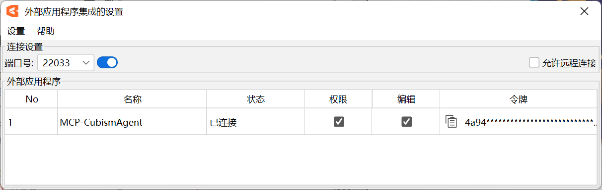

# Cubism External Edit MCP

[](https://www.python.org/)
[](https://modelcontextprotocol.io/)
[](LICENSE)

[中文](README.md) | [English](README_EN.md)

Wrap the Live2D Cubism Editor External API as **MCP (Model Context Protocol)** tools, enabling AI Agents (such as Workbuddy) to control Cubism Editor through natural language.

> Official Reference: [Cubism Editor External API Integration](https://cubism.live2d.com/editor-alpha/doc/manual/alpha1/en/external-api-intergration/index.html)

## Architecture

```
AI Agent (Workbuddy)
    │
    │ stdio (MCP Protocol)
    │
┌───▼──────────────────────┐
│  cubism_mcp.py    │  ← This Project
│  (MCP Server, 9 Tools)   │
└───┬──────────────────────┘
    │
    │ WebSocket (ws://localhost:22033)
    │
┌───▼──────────────────────┐
│  Cubism Editor 5.4 Alpha │
│  (External API)           │
└──────────────────────────┘
```

## Features

- **Full Model Inspection** — Parameter structure, part structure, deformer structure, individual object details
- **Edit Operations** — CRUD for parameters, parts, deformers, ArtMesh, and Glue, with automatic transaction wrapping
- **Batch Editing** — Execute multiple operations within a single transaction; any failure triggers automatic rollback
- **Permission Levels** — Allow for read access, Edit for write access
- **Auto Reconnect** — Reconnects every 3 seconds after Editor restart
- **Token Persistence** — Authentication token cached in `token.txt` to avoid repeated authorization

## Requirements

| Component | Version |
|-----------|---------|
| Python | ≥ 3.10 |
| Cubism Editor | 5.4 Alpha (valid until 2026-09-14) |
| OS | Windows / macOS |

## MCP Client Configuration

> Also supports Claude Code, Codex, OpenCode and other MCP-compatible clients.

### Option 1: uvx One-Line (Recommended)

In Workbuddy: Settings → MCP → Edit JSON → add `cubism-mcp` under `mcpServers`:

```json
{
  "mcpServers": {
    "cubism-mcp": {
      "type": "stdio",
      "command": "uvx",
      "args": ["--from", "git+https://github.com/nana7chi/CubismExternalEditMCP.git", "cubism-mcp"],
      "description": "Cubism Editor MCP"
    }
  }
}
```

### Option 2: Local Clone

1. Clone the repository:

```bash
git clone https://github.com/nana7chi/CubismExternalEditMCP.git
```

2. In Workbuddy: Settings → MCP → Edit JSON → add `cubism-mcp` under `mcpServers` (change `cwd` to the actual path):

```json
{
  "mcpServers": {
    "cubism-mcp": {
      "type": "stdio",
      "command": "python",
      "args": ["cubism_mcp.py"],
      "cwd": "J:/change/to/your/actual/path/CubismExternalEditMCP",
      "description": "Cubism Editor MCP"
    }
  }
}
```

## Usage

1. Launch Cubism Editor and open a model
2. **File → External App Integration Settings** → port `22033` → enable
3. In the dialog, **check Allow + Edit**, then confirm
4. Control the Editor through natural language in your AI Agent



## Example Prompts

```
"List the parameter structure of the current model"
"Inspect the part hierarchy"
"Change the Core part label to blue"
"Create parameter ParamsTest, ID ParamTest, range 0-1, default 0.5"
"Batch add 3 keyframes to ParamAngleX"
"Select the GlobalXY deformer and move it to position (3000, 4000)"
```

## Available Tools

### Diagnostics

| Tool | Description |
|------|-------------|
| `cubism_status` | Check connection status, registration status, authorization, and edit authorization |

### Inspection

| Tool | Parameters | Description |
|------|-----------|-------------|
| `cubism_get_model_uid` | — | Get UID of the currently opened model |
| `cubism_get_parameter_structure` | `model_uid` | Parameter structure tree (groups + params with Min/Default/Max) |
| `cubism_get_part_structure` | `model_uid` | Part structure tree (ArtMesh/Deformer/Part/Glue) |
| `cubism_get_deformer_structure` | `model_uid` | Deformer structure tree |
| `cubism_get_object` | `model_uid`, `id` | Get details of a specific object (varies by type) |
| `cubism_get_selected` | `model_uid` | Get list of currently selected objects in Editor |

### Editing

| Tool | Parameters | Description |
|------|-----------|-------------|
| `cubism_edit` | `action`, `params` | Execute a single edit operation (auto Begin/End) |
| `cubism_edit_batch` | `actions[]` | Batch edit (single transaction, auto rollback on failure) |

#### Supported Edit Actions

`AddParameter`, `EditParameter`, `DeleteParameter`, `AddParameterGroup`, `EditParameterGroup`, `AddPart`, `EditPart`, `AddWarpDeformer`, `AddRotationDeformer`, `EditWarpDeformer`, `EditArtMesh`, `EditGlue`, `MoveParameter`, `MoveParameterGroup`, `AddParameterKey`, `DeleteParameterKey`, `MoveParameterKey`, `DeleteObject`, `MoveObjectOnPartsPalette`

## Troubleshooting

| Symptom | Cause | Solution |
|---------|-------|----------|
| MCP status red | Wrong Python path, missing dependencies, or incorrect `cwd` | Verify Python ≥ 3.10, dependencies installed, and `cwd` path |
| Not connected to Editor | Editor not running or external integration not enabled | Launch Editor → open model → enable external integration |
| Not approved | Allow not checked in dialog | Check Allow in external integration dialog |
| Edit errors | Edit not checked in dialog | Check Edit in external integration dialog |
| Broken after restart | Editor restart requires re-authorization | Re-enable external integration and re-check permissions |
| Operation errors | Incorrect parameter names or IDs | Run `cubism_get_*_structure` first to inspect the model |

## Development

```bash
# Run directly for testing
python cubism_mcp.py

# Install dependencies
pip install -r requirements.txt
```

### Dependencies

| Package | Purpose |
|---------|---------|
| `mcp` | MCP server framework (stdio communication) |
| `websockets` | WebSocket client for Editor API connection |
| `pydantic` | Data model validation |
| `nest_asyncio` | Nested event loop support |

## Notes

- **Alpha Limitations**: Cubism Editor 5.4 Alpha expires on 2026-09-14; upgrade required afterwards
- **Restart Re-auth**: Re-enable external integration and re-check permissions after each Editor restart
- **Single Model**: The MCP server operates on one open model at a time
- **Transaction Safety**: Edit operations are automatically wrapped with `EditBegin/EditEnd`; batch operations auto `Cancel` and rollback on failure

## License

MIT
