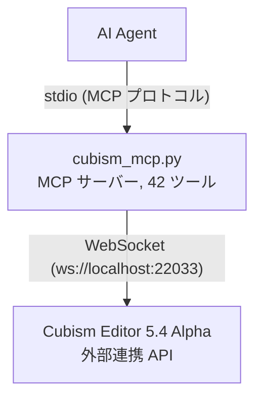

# Cubism External Edit MCP

[](https://www.live2d.com/cubism/download/editor/)
[](https://www.python.org/)
[](https://modelcontextprotocol.io/)
[](https://pypi.org/project/cubism-mcp/)

[](LICENSE)
[](https://github.com/nana7chi/CubismExternalEditMCP/stargazers)
[](https://github.com/nana7chi/CubismExternalEditMCP/commits)

[中文](../README.md) | [English](README_EN.md) | 日本語 | [한국어](README_KO.md)

Live2D Cubism Editor の外部連携 API を **MCP (Model Context Protocol)** ツールとしてラップし、AI Agent が自然言語で Cubism Editor を操作できるようにします。

> 公式リファレンス：https://creatorsforum.live2d.com/t/topic/3938

## アーキテクチャ



## 機能

- **読み書き操作** — モデルのパラメータ値読み書き、ドキュメント一覧表示、編集モード取得（Editor 4.x 以降対応）
- **モデルの完全な検査** — パラメータ構造、パーツ構造、デフォーマ構造、個別オブジェクトの詳細（5.4 Alpha が必要）
- **編集操作** — パラメータ/パーツ/デフォーマ/アートメッシュ/グルーの追加・編集・削除、自動トランザクション処理（5.4 Alpha が必要）
- **バッチ編集** — 単一トランザクションで複数操作を実行、失敗時は自動ロールバック
- **権限の段階分け** — 参照には「許可」、編集には「編集」の承認が必要
- **自動再接続** — Editor 再起動後、3 秒間隔で自動再接続
- **トークンの永続化** — 認証トークンを `~/.cubism-mcp/token.txt` にキャッシュし、再認証を回避

## 要件

| コンポーネント | バージョン |
|--------------|-----------|
| Python | ≥ 3.10 |
| Cubism Editor | 5.4 Alpha（有効期限：2026-09-14） |
| OS | Windows / macOS |

## 使用方法

### クイックスタート

**以下のプロンプトを AI Agent にコピーして送信してください**：

> https://github.com/nana7chi/CubismExternalEditMCP/blob/master/README.md に従って、cubism-mcp をインストールして設定してください。このコンピュータに `uv` がインストールされていない場合は、先にインストールしてください。準備ができたら教えてください。


### ステップ 1：uv のインストール（初回のみ）

`uv` は軽量な Python パッケージマネージャで、本 MCP の自動インストールと実行に使用します。インストール後は Python 環境の管理が不要になります。

**macOS**（ターミナルに貼り付け）：
```bash
curl -LsSf https://astral.sh/uv/install.sh | sh
```

**Windows**（PowerShell に貼り付け）：
```powershell
powershell -ExecutionPolicy ByPass -c "irm https://astral.sh/uv/install.ps1 | iex"
```

インストール完了後、**ターミナルを再起動**し、`uv --version` でバージョンが表示されれば成功です。

> uv をインストールしたくない場合：Python（≥3.10）をローカルに用意し、`pip install -r requirements.txt` で依存パッケージをインストール後、`python cubism_mcp.py` で実行することもできます。ただし、依存関係はご自身で管理してください。

### ステップ 2：AI Agent に MCP を設定

> `ClaudeCode`、`Codex`、`Workbuddy` など各種 MCP 対応クライアントで動作します。

> 初回起動時は依存パッケージの自動ダウンロードに約 1〜2 分かかります。以降は即時起動します。

#### 方法 1：PyPI インストール（推奨）

```json
{
  "mcpServers": {
    "cubism-mcp": {
      "type": "stdio",
      "command": "uvx",
      "args": ["cubism-mcp"],
      "description": "Cubism Editor MCP",
      "env": { "NO_PROXY": "localhost,127.0.0.1" }
    }
  }
}
```

#### 中国ミラー設定

PyPI 公式が遅い場合は、中国ミラー（清華大学/Alibaba/Tencent Cloud など）を使用できます：

```json
{
  "mcpServers": {
    "cubism-mcp": {
      "type": "stdio",
      "command": "uvx",
      "args": ["--index-url", "https://pypi.tuna.tsinghua.edu.cn/simple", "cubism-mcp"],
      "description": "Cubism Editor MCP",
      "env": { "NO_PROXY": "localhost,127.0.0.1" }
    }
  }
}
```

> Alibaba `https://mirrors.aliyun.com/pypi/simple` または Tencent Cloud `https://mirrors.cloud.tencent.com/pypi/simple` に置き換えも可能です。

#### 方法 2：uvx オンライン実行（GitHub ソース）

以下のMCP設定を追加：

```json
{
  "mcpServers": {
    "cubism-mcp": {
      "type": "stdio",
      "command": "uvx",
      "args": ["--from", "git+https://github.com/nana7chi/CubismExternalEditMCP.git", "cubism-mcp"],
      "description": "Cubism Editor MCP",
      "env": { "NO_PROXY": "localhost,127.0.0.1" }
    }
  }
}
```

#### 方法 3：ローカルクローン実行

1. ソースコードをクローン（またはZIPをダウンロードして解凍）

```bash
git clone https://github.com/nana7chi/CubismExternalEditMCP.git
```

2. 以下のMCP設定を追加（`cwd` を実際のパスに変更）：

```json
{
  "mcpServers": {
    "cubism-mcp": {
      "type": "stdio",
      "command": "python",
      "args": ["cubism_mcp.py"],
      "cwd": "J:/実際のパスに変更/CubismExternalEditMCP",
      "description": "Cubism Editor MCP",
      "env": { "NO_PROXY": "localhost,127.0.0.1" }
    }
  }
}
```

### ステップ 3：Cubism Editor で外部連携を有効化

1. Cubism Editor 5.4 Alpha を起動し、モデルを開く
2. メニュー「**ファイル**」→「**外部アプリケーション連携の設定**」
3. ポートが `22033` であることを確認し、「**使用**」トグルをオンにする
4. 認証ダイアログが表示されたら `cubism-mcp` を見つけ、**「許可」と「編集」にチェックを入れて** OK をクリック

> ダイアログが表示されない場合は、Editor 右下の点滅する外部アプリアイコンを確認してください。クリックするとダイアログが開きます。


### ステップ 4：使用開始

AI Agent で自然言語を使って Editor を操作します。例：

```
「現在のモデルのパラメータ構造をリスト表示」
「パーツ階層を確認」
「眉毛パーツのラベル色を青に変更」
「パラメータ ParamsTest、ID ParamTest、範囲 0-1、デフォルト 0.5 を作成」
「ParamAngleX にキーフォームを 3 つ一括追加」
```

## 利用可能なツール

### 診断

| ツール | APIバージョン | 説明 |
|------|------------|------|
| `cubism_status` | 接続状態、登録状態、許可/編集の認証状態を確認 |

### 読み書き

| ツール | APIバージョン | パラメータ | 説明 |
|------|------------|-----------|------|
| `cubism_get_model_uid` | — | 現在開いているモデルの UID を取得 |
| `cubism_get_documents` | — | 開いているすべてのドキュメントを一覧表示（モデリング/物理演算/アニメーション） |
| `cubism_get_document` | `document_uid` | UID で単一ドキュメントの詳細を取得 |
| `cubism_get_current_edit_mode` | — | 現在の編集モードを取得（Physics/Modeling/Animation/…） |
| `cubism_get_parameter_values` | `model_uid`, `ids?` | モデルのパラメータ現在値を読み取り |
| `cubism_set_parameter_values` | `model_uid`, `parameters[]` | パラメータ値を書き込み（編集トランザクション不要） |
| `cubism_clear_parameter_values` | `model_uid` | SetParameterValues の一時バッファをクリア |
| `cubism_get_parameters` | `model_uid` | パラメータのメタ情報（名前/範囲/キーフォーム/タイプ） |
| `cubism_get_parameter_groups` | `model_uid` | パラメータグループ一覧 |

### 構造の検査（5.4 Alpha 新規）

| ツール | APIバージョン | パラメータ | 説明 |
|------|------------|-----------|------|
| `cubism_get_parameter_structure` | `model_uid` | 完全なパラメータ構造ツリー（グループ+パラメータ階層） |
| `cubism_get_part_structure` | `model_uid` | パーツ構造ツリー（アートメッシュ/デフォーマ/パーツ/グルー） |
| `cubism_get_deformer_structure` | `model_uid` | デフォーマ構造ツリー |
| `cubism_get_object` | `model_uid`, `id` | 指定オブジェクトの詳細を取得 |
| `cubism_get_selected` | `model_uid` | Editor で現在選択中のオブジェクト一覧を取得 |
| `cubism_get_parameter_keys` | `model_uid`, `object_id` | オブジェクトのキーフォーム関連を取得 |
| `cubism_get_objects_by_parameter_keys` | `model_uid`, `parameter_id`, `key_value` | パラメータのキーフォームから関連オブジェクトを逆引き |

### 編集（5.4 Alpha 新規）

| ツール | APIバージョン | パラメータ | 説明 |
|------|------------|-----------|------|
| `cubism_edit` | `action`, `params` | 単一の編集操作を実行（EditBegin/EditEnd を自動処理） |
| `cubism_edit_batch` | `actions[]` | バッチ編集（同一トランザクション、失敗時は自動ロールバック） |
| `cubism_add_selected_objects` | `model_uid`, `ids[]` | プログラムでオブジェクトを選択（既存の選択を保持） |
| `cubism_clear_selected_objects` | `model_uid` | すべての選択状態を解除 |

#### サポートされる編集 Action

| Action | 主要パラメータ | 説明 | プロンプト例 |
|--------|--------------|------|------------|
| `AddParameter` | `GroupId`, `ParameterName`, `ParameterId`, `Default`, `Minimum`, `Maximum` | 指定グループにパラメータを追加 | 「パラメータ'テスト'、ID ParamTest、範囲0〜1、デフォルト0.5を'表情切替'グループに作成」 |
| `EditParameter` | `Id`, `ParameterName`, `Default`, `Minimum`, `Maximum` | パラメータプロパティを編集 | 「ParamTest の最大値を 2 に変更」 |
| `DeleteParameter` | `Id` | パラメータを削除 | 「ParamTest パラメータを削除」 |
| `AddParameterGroup` | `GroupName`, `GroupId`, `ParentGroupId` | パラメータグループを追加 | 「パラメータグループ'テストグループ'を作成」 |
| `EditParameterGroup` | `Id`, `GroupName`, `LabelColorType`, `LabelCustomColor` | グループプロパティを編集 | 「'XYZ'グループのラベル色を青に変更」 |
| `DeleteParameterGroup` | `Id` | パラメータグループを削除 | 「'テストグループ'パラメータグループを削除」 |
| `MoveParameter` | `Id`, `NewGroupId`, `InsertPosition` | パラメータを新しい位置/グループに移動 | 「ParamTest を'XYZ'グループの先頭に移動」 |
| `MoveParameterGroup` | `Id`, `InsertPosition` | パラメータグループの順序を変更 | 「'眉毛'グループを先頭に移動」 |
| `AddParameterKey` | `ParameterId`, `KeyValue` | パラメータにキーフォームを追加 | 「ParamAngleX の 0.5 にキーフォームを追加」 |
| `DeleteParameterKey` | `ParameterId`, `KeyValue` | パラメータのキーフォームを削除 | 「ParamAngleX の -30 にあるキーフォームを削除」 |
| `MoveParameterKey` | `ParameterId`, `OldKeyValue`, `NewKeyValue` | キーフォームの位置を移動 | 「ParamAngleX の 0.5 のキーフォームを 0.8 に移動」 |
| `AddPart` | `Name`, `Id`, `ParentId` | パーツを追加 | 「'左目'の下にパーツ'瞳孔'を作成」 |
| `EditPart` | `Id`, `Name`, `LabelColorType`, `LabelCustomColor`, `Opacity` | パーツプロパティを編集<br>⚠️ ラベル色は `LabelColorType`+`LabelCustomColor` を使用。`LabelColor` ではありません | 「'眉毛'パーツのラベル色を青に変更」 |
| `AddWarpDeformer` | `Name`, `Id`, `ParentId` | ワープデフォーマを追加 | 「'前髪'の下にワープデフォーマを作成」 |
| `AddRotationDeformer` | `Name`, `Id`, `ParentId` | 回転デフォーマを追加 | 「'頭'の下に回転デフォーマを作成」 |
| `EditWarpDeformer` | `Id`, `Name`, ... | ワープデフォーマのプロパティを編集 | 「ワープデフォーマ'曲面2'の名前を'顔'に変更」 |
| `EditRotationDeformer` | `Id`, `Name`, `Angle`, `Scale`, ... | 回転デフォーマのプロパティを編集 | 「顔の回転角度を15度に変更」 |
| `EditArtMesh` | `Id`, `Opacity`, ... | アートメッシュのプロパティを編集 | 「アートメッシュ'左目ハイライト'の不透明度を50%に変更」 |
| `EditGlue` | `Id`, ... | グルーのプロパティを編集 | 「グルーオブジェクトのウェイトを調整」 |
| `DeleteObject` | `Id` | パーツパレットからオブジェクトを削除 | 「ID Warp999 のオブジェクトを削除」 |
| `MoveObjectOnPartsPalette` | `Id`, `NewParentId`, `InsertPosition` | パーツパレット内のオブジェクト位置を移動 | 「ワープデフォーマ'曲面2'を位置 0 に移動」 |

## トラブルシューティング

| 症状 | 原因 | 解決策 |
|------|------|--------|
| MCP ステータスが赤 | Python パス/依存関係/`cwd` の誤り | Python ≥ 3.10 の確認、依存パッケージのインストール、`cwd` パスの確認 |
| Editor に未接続 | Editor が未起動または外部連携が無効 | Editor を起動 → モデルを開く → ファイルメニューから外部連携を有効化 |
| 未認証 | ダイアログで「許可」が未チェック | 外部連携ダイアログで「許可」をチェック |
| 編集エラー | ダイアログで「編集」が未チェック | 外部連携ダイアログで「編集」をチェック |
| 再起動後に動作しない | Editor 再起動時に再認証が必要 | 外部連携を再度有効化し、権限を再チェック |
| 操作エラー | パラメータ/ID が誤り | 先に `cubism_get_*_structure` で構造を確認してから操作 |

## 開発

```bash
# テスト用に直接実行
python cubism_mcp.py

# 依存パッケージのインストール
pip install -r requirements.txt
```

### 依存パッケージ

| パッケージ | 用途 |
|---------|------|
| `mcp` | MCP サーバーフレームワーク（FastMCP + stdio 通信） |
| `websockets` | WebSocket クライアント、Editor API 接続用 |

## 注意事項

- **Alpha 版の制限**：Cubism Editor 5.4 Alpha の有効期限は 2026-09-14 です。期限後はアップグレードが必要です
- **再起動時の再認証**：Editor を再起動するたびに、外部連携の再有効化と権限の再チェックが必要です
- **単一モデル**：MCP サーバーは同時に 1 つのモデルのみ操作できます
- **トランザクションの安全性**：編集操作は自動的に `EditBegin/EditEnd` でラップされ、バッチ操作は失敗時に自動 `Cancel` でロールバックします

## ライセンス

MIT
