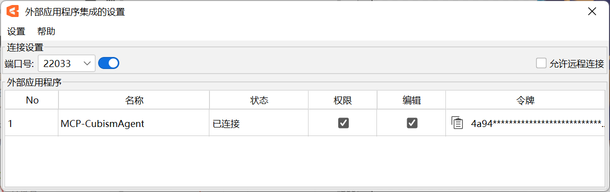

# Cubism External Edit MCP

[](https://www.live2d.com/cubism/download/editor/)
[](https://www.python.org/)
[](https://modelcontextprotocol.io/)
[](https://lobehub.com/mcp/nana7chi-cubismexternaleditmcp)

[](LICENSE)
[](https://github.com/nana7chi/CubismExternalEditMCP/stargazers)
[](https://github.com/nana7chi/CubismExternalEditMCP/commits)

[中文](../README.md) | [English](README_EN.md) | [日本語](README_JA.md) | 한국어

Live2D Cubism Editor의 외부 연동 API를 **MCP (Model Context Protocol)** 도구로 래핑하여, AI Agent가 자연어로 Cubism Editor를 조작할 수 있도록 합니다.

> 공식 레퍼런스: https://creatorsforum.live2d.com/t/topic/3938

## 아키텍처

```
AI Agent
    │
    │ stdio (MCP 프로토콜)
    │
┌───▼──────────────────────┐
│  cubism_mcp.py    │  ← 본 프로젝트
│  (MCP 서버, 9 도구)        │
└───┬──────────────────────┘
    │
    │ WebSocket (ws://localhost:22033)
    │
┌───▼──────────────────────┐
│  Cubism Editor 5.4 Alpha │
│  (외부 연동 API)           │
└──────────────────────────┘
```

## 기능

- **완전한 모델 검사** — 파라미터 구조, 파트 구조, 디포머 구조, 개별 오브젝트 상세
- **편집 작업** — 파라미터/파트/디포머/아트메시/글루의 추가·편집·삭제, 자동 트랜잭션 처리
- **배치 편집** — 단일 트랜잭션으로 여러 작업 실행, 실패 시 자동 롤백
- **권한 단계** — 조회는 「허용」, 편집은 「편집」 승인�� 필요
- **자동 재접속** — Editor 재시작 후 3초 간격으로 자동 재접속
- **토큰 유지** — 인증 토큰을 `~/.cubism-mcp/token.txt`에 캐시하여 재인증 방지

## 요구 사항

| 구성 요소 | 버전 |
|-----------|------|
| Python | ≥ 3.10 |
| Cubism Editor | 5.4 Alpha (유효 기간: 2026-09-14) |
| OS | Windows / macOS |

## 사용 방법

### 빠른 시작

**아래 프롬프트를 복사하여 AI Agent에 보내세요**:

> https://github.com/nana7chi/CubismExternalEditMCP/blob/master/README.md에 따라 cubism-mcp를 설치 및 설정해 주세요. 이 컴퓨터에 `uv`가 설치되어 있지 않다면 먼저 설치해 주세요. 준비가 완료되면 알려주세요.


### 1단계: uv 설치 (최초 1회)

`uv`는 경량 Python 패키지 관리자로, 본 MCP의 자동 설치 및 실행에 사용됩니다. 설치 후에는 Python 환경 관리가 필요하지 않습니다.

**macOS** (터미널에 붙여넣기):
```bash
curl -LsSf https://astral.sh/uv/install.sh | sh
```

**Windows** (PowerShell에 붙여넣기):
```powershell
powershell -ExecutionPolicy ByPass -c "irm https://astral.sh/uv/install.ps1 | iex"
```

설치 완료 후 **터미널을 재시작**하고 `uv --version`으로 버전이 표시되면 성공입니다.

> uv를 설치하고 싶지 않은 경우: Python(≥3.10)을 로컬에 준비하고, `pip install -r requirements.txt`로 종속 패키지를 설치한 후 `python cubism_mcp.py`로 실행할 수도 있습니다. 단, 종속성은 직접 관리해야 합니다.

### 2단계: AI Agent에 MCP 설정

> `ClaudeCode`, `Codex`, `Workbuddy` 등 다양한 MCP 호환 클라이언트에서 동작합니다.

> 최초 실행 시 종속 패키지 자동 다운로드에 약 1~2분 소요됩니다. 이후에는 즉시 시작됩니다.

#### 방법 1: uvx 온라인 실행 (권장)

다음 MCP 설정 추가:

```json
{
  "mcpServers": {
    "cubism-mcp": {
      "type": "stdio",
      "command": "uvx",
      "args": ["--from", "git+https://github.com/nana7chi/CubismExternalEditMCP.git", "cubism-mcp"],
      "description": "Cubism Editor MCP"
    }
  }
}
```

#### 방법 2: 로컬 클론 실행

1. 소스 코드 클론 (또는 ZIP 다운로드 후 압축 해제)

```bash
git clone https://github.com/nana7chi/CubismExternalEditMCP.git
```

2. 다음 MCP 설정 추가 (`cwd`를 실제 경로로 변경):

```json
{
  "mcpServers": {
    "cubism-mcp": {
      "type": "stdio",
      "command": "python",
      "args": ["cubism_mcp.py"],
      "cwd": "J:/실제 경로로 변경/CubismExternalEditMCP",
      "description": "Cubism Editor MCP"
    }
  }
}
```

### 3단계: Cubism Editor에서 외부 연동 활성화

1. Cubism Editor 5.4 Alpha를 실행하고 모델 열기
2. 메뉴 「**파일**」→「**외부 애플리케이션 연동 설정**」
3. 포트가 `22033`인지 확인하고 「**사용**」 토글 켜기
4. 인증 대화 상자가 표시되면 `cubism-mcp`를 찾아 **「허용」과 「편집」에 체크**하고 OK 클릭

> 대화 상자가 표시되지 않으면 Editor 오른쪽 하단의 깜박이는 외부 앱 아이콘을 확인하세요. 클릭하면 대화 상자가 열립니다.



### 4단계: 사용 시작

AI Agent에서 자연어로 Editor를 조작합니다. 예:

```
"현재 모델의 파라미터 구조 나열"
"파트 계층 확인"
"눈썹 파트의 라벨 색상을 파란색으로 변경"
"파라미터 ParamsTest, ID ParamTest, 범위 0-1, 기본값 0.5 생성"
"ParamAngleX에 키폼 3개 일괄 추가"
```

> **주의**: Cubism Editor를 재시작할 때마�� 「외부 애플리케이션 연동 설정」 스위치를 다시 켜고 「허용」과 「편집」 권한을 다시 체크해야 합니다.

## 사용 가능한 도구

### 진단

| 도구 | 설명 |
|------|------|
| `cubism_status` | 접속 상태, 등록 상태, 인증 상태, 편집 인증 확인 |

### 검사

| 도구 | 파라미터 | 설명 |
|------|---------|------|
| `cubism_get_model_uid` | — | 현재 열려 있는 모델의 UID 가져오기 |
| `cubism_get_parameter_structure` | `model_uid` | 파라미터 구조 트리 (그룹+파라미터, Min/Default/Max 포함) |
| `cubism_get_part_structure` | `model_uid` | 파트 구조 트리 (아트메시/디포머/파트/글루) |
| `cubism_get_deformer_structure` | `model_uid` | 디포머 구조 트리 |
| `cubism_get_object` | `model_uid`, `id` | 지정된 오브젝트 상세 가져오기 (타입에 따라 구조 다름) |
| `cubism_get_selected` | `model_uid` | Editor에서 현재 선택된 오브젝트 목록 가져오기 |

### 편집

| 도구 | 파라미터 | 설명 |
|------|---------|------|
| `cubism_edit` | `action`, `params` | 단일 편집 작업 실행 (EditBegin/EditEnd 자동 처리) |
| `cubism_edit_batch` | `actions[]` | 배치 편집 (동일 트랜잭션, 실패 시 자동 롤백) |

#### 지원되는 편집 Action

| Action | 주요 파라미터 | 설명 | 프롬프트 예시 |
|--------|-------------|------|-------------|
| `AddParameter` | `GroupId`, `ParameterName`, `ParameterId`, `Default`, `Minimum`, `Maximum` | 지정 그룹에 파라미터 추가 | 「파라미터 '테스트', ID ParamTest, 범위 0~1, 기본값 0.5, '표정 전환' 그룹에 생성」 |
| `EditParameter` | `Id`, `ParameterName`, `Default`, `Minimum`, `Maximum` | 파라미터 속성 편집 | 「ParamTest의 최대값을 2로 변경」 |
| `DeleteParameter` | `Id` | 파라미터 삭제 | 「ParamTest 파라미터 삭제」 |
| `AddParameterGroup` | `GroupName`, `GroupId`, `ParentGroupId` | 파라미터 그룹 추가 | 「파라미터 그룹 '테스트 그룹' 생성」 |
| `EditParameterGroup` | `Id`, `GroupName`, `LabelColorType`, `LabelCustomColor` | 그룹 속성 편집 | 「'XYZ' 그룹의 라벨 색상을 파란색으로 변경」 |
| `MoveParameter` | `Id`, `NewGroupId`, `InsertPosition` | 파라미터를 새 위치/그룹으로 이동 | 「ParamTest를 'XYZ' 그룹의 맨 앞으로 이동」 |
| `MoveParameterGroup` | `Id`, `InsertPosition` | 파라미터 그룹 순서 변경 | 「'눈썹' 그룹을 첫 번째로 이동」 |
| `AddParameterKey` | `ParameterId`, `KeyValue` | 파라미터에 키폼 추가 | 「ParamAngleX의 0.5 위치에 키폼 추가」 |
| `DeleteParameterKey` | `ParameterId`, `KeyValue` | 파라미터 키폼 삭제 | 「ParamAngleX의 -30에 있는 키폼 삭제」 |
| `MoveParameterKey` | `ParameterId`, `OldKeyValue`, `NewKeyValue` | 키폼 위치 이동 | 「ParamAngleX의 0.5 키폼을 0.8로 이동」 |
| `AddPart` | `Name`, `Id`, `ParentId` | 파트 추가 | 「'왼쪽 눈' 아래에 파트 '동공' 생성」 |
| `EditPart` | `Id`, `Name`, `LabelColorType`, `LabelCustomColor`, `Opacity` | 파트 속성 편집<br>⚠️ 라벨 색상은 `LabelColorType`+`LabelCustomColor` 사용. `LabelColor`가 아닙니다 | 「'눈썹' 파트의 라벨 색상을 파란색으로 변경」 |
| `AddWarpDeformer` | `Name`, `Id`, `ParentId` | 워프 디포머 추가 | 「'앞머리' 아래에 워프 디포머 생성」 |
| `AddRotationDeformer` | `Name`, `Id`, `ParentId` | 회전 디포머 추가 | 「'머리' 아래에 회전 디포머 생성」 |
| `EditWarpDeformer` | `Id`, `Name`, ... | 워프 디포머 속성 편집 | 「워프 디포머 '곡면2'의 이름을 '얼굴'로 변경」 |
| `EditArtMesh` | `Id`, `Opacity`, ... | 아트메시 속성 편집 | 「아트메시 '왼쪽 눈 하이라이트'의 불투명도�� 50%로 변경」 |
| `EditGlue` | `Id`, ... | 글루 속성 편집 | 「글루 오브젝트의 웨이트 조정」 |
| `DeleteObject` | `Id` | 파트 팔레트에서 오브젝트 삭제 | 「ID Warp999 오브젝트 삭제」 |
| `MoveObjectOnPartsPalette` | `Id`, `NewParentId`, `InsertPosition` | 파트 팔레트에서 오브젝트 위치 이동 | 「워프 디포머 '곡면2'를 위치 0으로 이동」 |

## 문제 해결

| 증상 | 원인 | 해결 방법 |
|------|------|----------|
| MCP 상태가 빨간색 | Python 경로/종속성/`cwd` 오류 | Python ≥ 3.10 확인, 종속성 설치 확인, `cwd` 경로 확인 |
| Editor에 연결되지 않음 | Editor 미실행 또는 외부 연동 비활성화 | Editor 실행 → 모델 열기 → 파일 메뉴에서 외부 연동 활성화 |
| 인증되지 않음 | 대화 상자에서 「허용」 미체크 | 외부 연동 대화 상자에서 「허용」 체크 |
| 편집 오류 | 대화 상자에서 「편집」 미체크 | 외부 연동 대화 상자에서 「편집」 체크 |
| 재시작 후 동작 안 함 | Editor 재시작 시 재인증 필요 | 외부 연동 재활성화 및 권한 재체크 |
| 작업 오류 | 파라미터/ID 오류 | 먼저 `cubism_get_*_structure`로 구조 확인 후 작업 |

## 개발

```bash
# 테스트용 직접 실행
python cubism_mcp.py

# 종속 패키지 설치
pip install -r requirements.txt
```

### 종속 패키지

| 패키지 | 용도 |
|--------|------|
| `mcp` | MCP 서버 프레임워크 (FastMCP + stdio 통신) |
| `websockets` | WebSocket 클라이언트, Editor API 연결용 |

## 주의 사항

- **Alpha 버전 제한**: Cubism Editor 5.4 Alpha의 유효 기간은 2026-09-14까지입니다. 만료 후 업그레이드가 필요합니다
- **재시작 시 재인증**: Editor를 재시작할 때마다 외부 연동 재활성화 및 권한 재체크가 필요합니다
- **단일 모델**: MCP 서버는 동시에 하나의 모델만 조작할 수 있습니다
- **트랜잭션 안전성**: 편집 작업은 자동으로 `EditBegin/EditEnd`로 래핑되며, 배치 작업 실패 시 자동 `Cancel`로 롤백됩니다

## 라이선스

MIT
